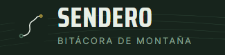
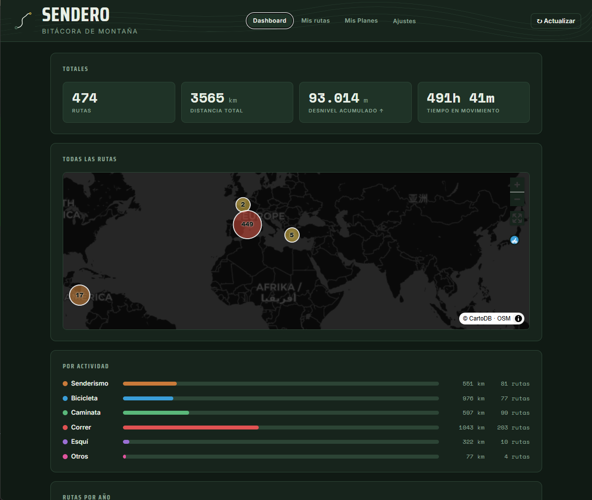
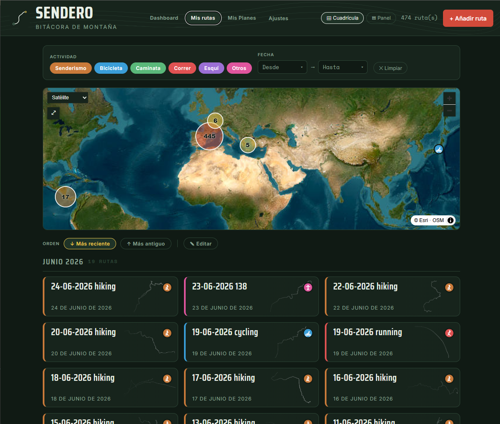
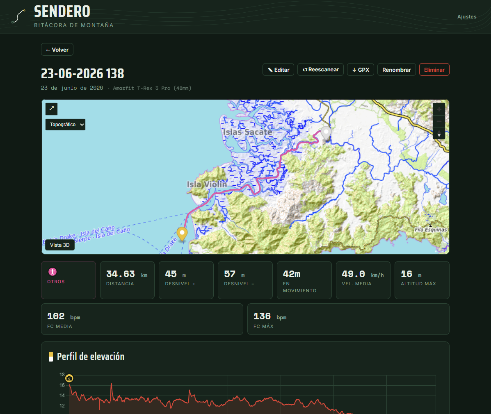
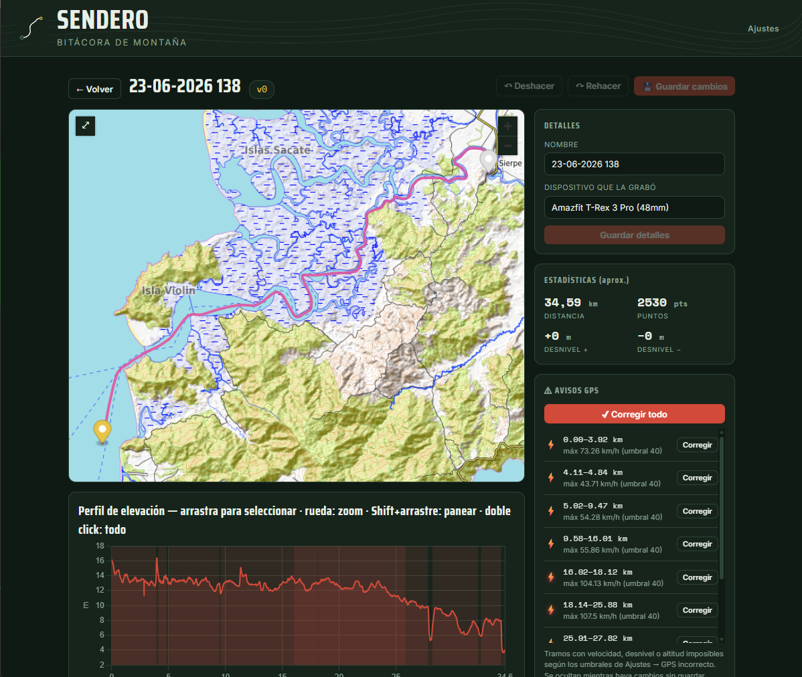
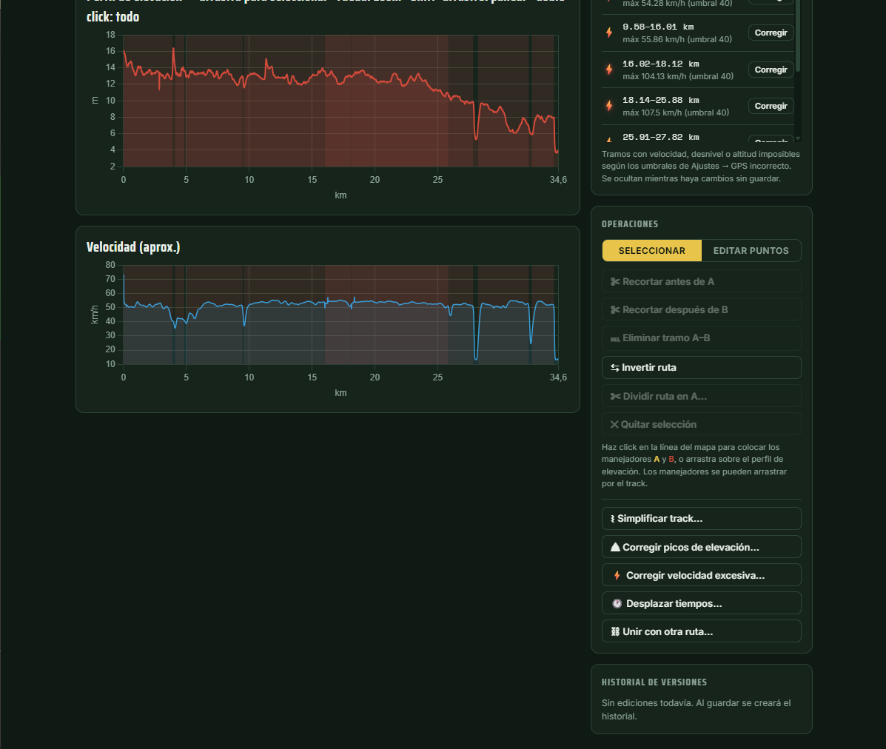

<p align="center">
  
</p>

<p align="center">
  <strong>Registra, visualiza y edita tus rutas GPX y FIT.</strong><br>
  <em>Autoalojado, sin nube y sin cuentas de terceros — tus datos se quedan en tu equipo.</em>
</p>

<p align="center">
  
  
  
  
</p>

---

**Sendero** es una bitácora autoalojada de rutas de montaña: una sola aplicación (Flask + SQLite, en un contenedor Docker) donde subes tus tracks **GPX** y **FIT** y los conviertes en un registro visual y navegable de tus salidas. Cada ruta se dibuja sobre mapas topográficos y de satélite con su perfil de elevación, velocidad y frecuencia cardíaca, calcula las estadísticas automáticamente y te deja asociar fotos —locales o de tu **Immich** por referencia—. Incluye un editor de tracks completo, detección de errores de GPS, analíticas globales y planificación de rutas futuras. Todo corre en un **único contenedor** en tu red local: sin servicios externos ni telemetría.

---

## Funcionalidades principales

En resumen, Sendero te permite:

- 📊 **Dashboard con resumen global** — totales, mapa de todas tus rutas, desglose por actividad y por año, y récords personales.
- 🗺️ **Visualizar cada ruta** en mapa topográfico o satélite con perfil de elevación, velocidad y frecuencia cardíaca.
- 📈 **Estadísticas automáticas** — distancia, desnivel +/−, tiempo en movimiento, velocidad media, altitud máx/mín, FC media/máx.
- 📷 **Fotos por ruta** — locales o desde Immich; las que llevan GPS en el EXIF se sitúan solas sobre el mapa.
- ✏️ **Editor de tracks** — recortar, invertir, editar vértices, simplificar, corregir picos, dividir y unir rutas, con versionado.
- ⚠️ **Avisos de GPS** — detecta tramos con velocidad, desnivel o altitud imposibles y los corrige.
- 🎯 **Planificación** — sube los GPX de rutas que quieres hacer y tenlas en una lista aparte.
- 🔄 **Importación automática** — deja caer los GPX en una carpeta vigilada y aparecen solos.

---

## Dashboard

La portada de Sendero: un resumen de todo lo que has recorrido, con las cifras globales, el mapa de todas tus rutas y tus mejores marcas de un vistazo.



> **En esta captura se ve:**
> - **Totales globales**: número de rutas, distancia total, desnivel acumulado y tiempo en movimiento.
> - **Mapa mundial** de todas las rutas con agrupación por zonas (*clustering*).
> - **Rutas por actividad**: kilómetros y número de rutas de cada tipo (senderismo, bicicleta, caminata, correr, esquí, otros).
> - **Rutas por año**: barras con el reparto de tus salidas por año (más abajo en la página).
> - **Récords personales**: tus mejores marcas —ruta más larga, mayor desnivel acumulado y velocidad media más alta— cada una enlazada a la ruta correspondiente.

---

## Mis Rutas

Todas tus salidas en un listado y un mapa navegable, con filtros y búsqueda.



> **En esta captura se ve:**
> - **Filtros** por actividad (chips de colores) y por rango de fechas.
> - **Mapa** con selector de capa base (aquí *Satélite*) y agrupación por zonas.
> - **Orden** por fecha (más reciente / más antiguo) y **modo edición** para selección múltiple.
> - **Tarjetas agrupadas por mes**, cada una con la **miniatura del track** y el icono de su actividad.
> - Vistas **Cuadrícula / Panel** y botón **«+ Añadir ruta»** (también acepta arrastrar y soltar el archivo).

---

## Detalle de ruta

Cada ruta abre una ficha completa con mapa, estadísticas, perfiles y fotos.



> **En esta captura se ve:**
> - **Nombre, fecha y dispositivo** que grabó la ruta (aquí un *Amazfit T-Rex 3 Pro*).
> - **Mapa topográfico** con el track y los marcadores de las fotos con GPS; botón **«Vista 3D»**.
> - **Estadísticas**: distancia, desnivel +/−, tiempo en movimiento, velocidad media y altitud máxima.
> - **Frecuencia cardíaca** media y máxima.
> - **Perfil de elevación** interactivo (con velocidad y FC sincronizados al pasar el ratón por el mapa).
> - Acciones: **Editar, Reescanear, descargar GPX, Renombrar y Eliminar**.

---

## Editor de rutas

Un editor de tracks completo con versionado *append-only*: cada guardado crea una versión nueva y puedes volver atrás cuando quieras.



> **En esta captura se ve:**
> - Panel **«Detalles»**: renombrar la ruta y cambiar el dispositivo sin salir del editor.
> - **Estadísticas aproximadas** (distancia, número de puntos, desnivel) recalculadas en vivo.
> - Panel **«Avisos GPS»** con la lista de tramos de velocidad/altitud imposibles y los botones **«Corregir»** y **«Corregir todo»**.
> - **Perfil de elevación** con bandas rojas marcando los tramos problemáticos.
> - **Deshacer / Rehacer**, versión actual (`v0`) y **«Guardar cambios»**.



> **En esta captura se ve:**
> - **Perfiles de elevación y velocidad** con las bandas de los avisos GPS.
> - Panel **«Operaciones»**: modos *Seleccionar* / *Editar puntos*, recortar inicio/fin, eliminar tramo, invertir y dividir la ruta.
> - Herramientas: **simplificar track** (Douglas-Peucker), **corregir picos de elevación**, **corregir velocidad excesiva**, **desplazar tiempos** y **unir con otra ruta**.
> - **Historial de versiones** restaurable.

---

## Planificación (Mis Planes)

¿Una ruta que quieres hacer? Sube su GPX a **Mis Planes** y quedará en una lista separada de tus salidas ya realizadas, con su mapa, estadísticas, notas y descarga del GPX. Desde ahí también puedes **dibujar una ruta nueva** en un planificador externo configurable (por defecto [brouter-web](https://brouter.de/brouter-web)).

## Immich (opcional)

Si tienes [Immich](https://immich.app), al abrir una ruta aparece el botón **⛰ Buscar en Immich**: Sendero toma la hora de inicio y fin del track, pregunta a Immich qué fotos se hicieron en esa ventana y te las muestra para elegir cuáles asociar. **No se copian: se enlazan por referencia**, así que Immich sigue siendo tu fototeca. Las que llevan GPS se marcan solas si están cerca del track; las demás se muestran igualmente (muchas fotos de montaña no llevan coordenadas). Ver la configuración más abajo.

---

## Arrancar

```bash
docker compose up -d --build
# abre http://localhost:8090   (el puerto host está en docker-compose.yml)
```

Los datos (GPX, fotos y base de datos) se guardan en `./data`, montado como volumen. Para mover la instalación a otro equipo, copia esa carpeta.

Sin Docker:

```bash
pip install -r requirements.txt
python app.py          # http://localhost:8080
```

## Conectar con Immich (opcional)

1. En Immich: **Cuenta → Configuración de la cuenta → Claves de API** → crea una clave.
   Dale al menos los permisos **`asset.read`** (buscar fotos) y **`asset.view`**
   (ver/descargar las miniaturas), o simplemente marca *todos los permisos*. Sin
   `asset.view` la búsqueda funciona y aparece el grid, pero **las miniaturas no
   cargan** (Immich responde con error de permisos y Sendero lo muestra como
   `502`); ver *Problemas frecuentes* más abajo.
2. En Sendero: botón **Ajustes** (cabecera) → sección Immich → pega la URL y la API key → Guardar.

Los ajustes se guardan en la base de datos y persisten entre reinicios. Si prefieres configurarlos como variables de entorno (útil para despliegues automatizados), puedes usar `IMMICH_URL`, `IMMICH_API_KEY`, `IMMICH_MARGIN_MIN` e `IMMICH_DIST_M`; la BD tiene prioridad si el valor también está guardado ahí.

> Cómo funciona el cruce: por **tiempo**, usando las marcas del track y el EXIF de las fotos en Immich. Por eso es importante que el reloj y el teléfono/cámara tengan la hora bien sincronizada.

### Problemas frecuentes con Immich

- **La búsqueda encuentra fotos y sale el grid, pero las miniaturas dan `502`
  (y no cargan).** La API key no tiene el permiso **`asset.view`**. Búsqueda y
  miniaturas usan permisos distintos: buscar solo necesita `asset.read`, pero
  servir cada imagen exige `asset.view`. Edita la clave en Immich (o crea una
  nueva) añadiendo `asset.view` — o marca todos los permisos — y vuelve a
  guardarla en Ajustes. No tiene que ver con exponer Sendero a internet ni con el
  reverse proxy: las miniaturas siempre las sirve el backend de Sendero por proxy,
  el navegador nunca habla con Immich.

## Cómo encaja con tu Amazfit T-Rex 3 Pro

1. En la app Zepp: abre el entrenamiento → menú `···` → **Exportar a GPX**.
2. El GPX queda en el teléfono. Con **Syncthing** sincronizas esa carpeta con el equipo donde corre Sendero (privado, sin nube).
3. En Sendero pulsas **+ Añadir ruta**, eliges el GPX y listo. O lo haces automático (abajo).

> El paso 1 sigue usando la app Zepp porque Gadgetbridge aún no extrae de forma fiable el track del T-Rex 3. Pero los archivos no salen de tu infraestructura.

## Importación automática (carpeta vigilada)

El servicio `watcher` del `docker-compose.yml` vigila la carpeta `./watch`. Apunta ahí tu carpeta sincronizada con Syncthing: cada GPX nuevo se sube solo a Sendero y se mueve a `./watch/imported/` (o a `./watch/failed/` si algo falla). Así, exportas en el reloj y la ruta aparece sola, sin tocar nada.

Variables (en el `docker-compose.yml`): `SENDERO_POLL` es cada cuántos segundos mira la carpeta (30 por defecto). El watcher espera a que el archivo deje de crecer antes de importarlo, para no pillar una copia de Syncthing a medias. Si no quieres importación automática, borra el servicio `watcher` del compose.

## Estructura

```
sendero/
├── app.py              # entrada Flask: registra blueprints, init_db() y refresh_config()
├── watch.py            # importador automático de carpeta (servicio aparte, no parte del server)
├── core/               # lógica: config, BD, parseo GPX/FIT, thumbnails, edición, EXIF, Immich, análisis GPS
├── api/                # blueprints REST: rutas, editor, fotos, planificación, Immich, ajustes
├── templates/
│   ├── app.html            # SPA: Dashboard, Mis Rutas y Mis Planes (MapLibre GL)
│   ├── sendero.html        # detalle de ruta: mapa, perfil, fotos, Immich
│   ├── editor.html         # editor de rutas
│   └── plan_detalle.html   # detalle de ruta planificada
├── static/             # logo e iconos
├── requirements.txt
├── Dockerfile
├── docker-compose.yml
└── data/               # volumen: sendero.db, gpx/, photos/, thumbs/
```

## API (por si quieres automatizar)

| Método | Ruta | Acción |
|--------|------|--------|
| `GET`  | `/api/routes` | lista de rutas |
| `POST` | `/api/routes` | sube un GPX o FIT (campo `gpx`) |
| `GET`  | `/api/routes/{id}` | detalle: stats, track, perfil, fotos |
| `PATCH`| `/api/routes/{id}` | renombrar / guardar notas / actividad |
| `DELETE`| `/api/routes/{id}` | borrar ruta |
| `POST` | `/api/routes/{id}/photos` | subir fotos locales (campo `photos`) |
| `GET`  | `/api/config` | indica si Immich está activo, la distancia de autoselección y la versión |
| `GET`  | `/api/settings` | leer ajustes actuales |
| `POST` | `/api/settings` | guardar ajustes (misma función que el modal Ajustes) |
| `GET`  | `/api/routes/{id}/immich/candidates` | fotos de Immich en la ventana del track |
| `POST` | `/api/routes/{id}/immich/select` | asocia los assets de Immich elegidos |
| `GET`  | `/api/planned` | lista de rutas planificadas |
| `POST` | `/api/planned` | añade una ruta planificada (campo `gpx`) |

El endpoint `POST /api/routes` permite automatizar la importación: un script que vigile la carpeta de Syncthing puede hacer `curl -F "gpx=@ruta.gpx"` por cada archivo nuevo.

## Limitaciones honestas (lo que NO es)

- **No es un gestor de fotos.** No hace miniaturas optimizadas, ni álbumes, ni reconocimiento, ni subida automática desde el carrete. Si quieres eso, usa Immich y conserva Sendero solo para las rutas.
- **Sin usuarios ni login.** Pensado para uso personal en tu red. No lo expongas a internet sin poner delante un proxy con autenticación (p. ej. Authelia / Caddy con basic-auth).
- **La correlación de fotos** usa el GPS del EXIF. Si tus fotos no llevan coordenadas, se muestran en la galería pero no en el mapa.

---

<p align="center">
  <sub>Novedades de cada versión en el <a href="CHANGELOG.md">CHANGELOG</a>.</sub>
</p>
