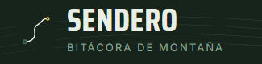
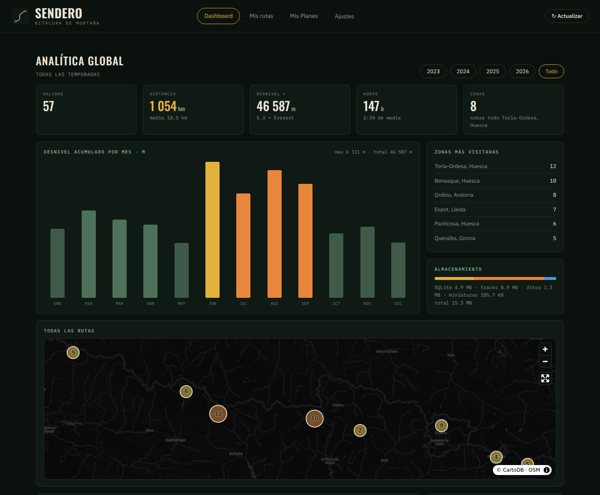
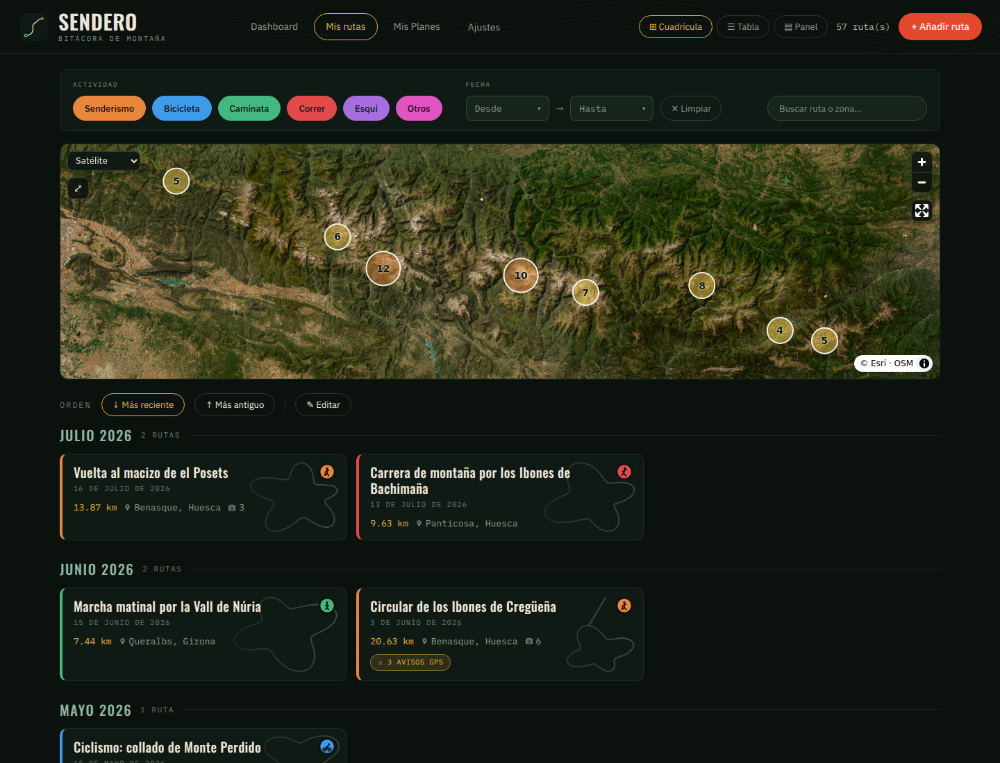
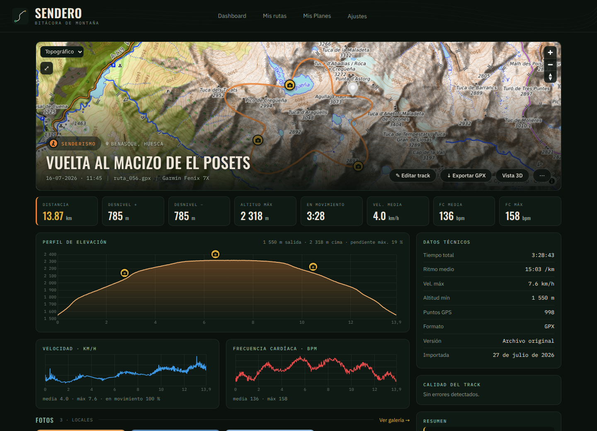
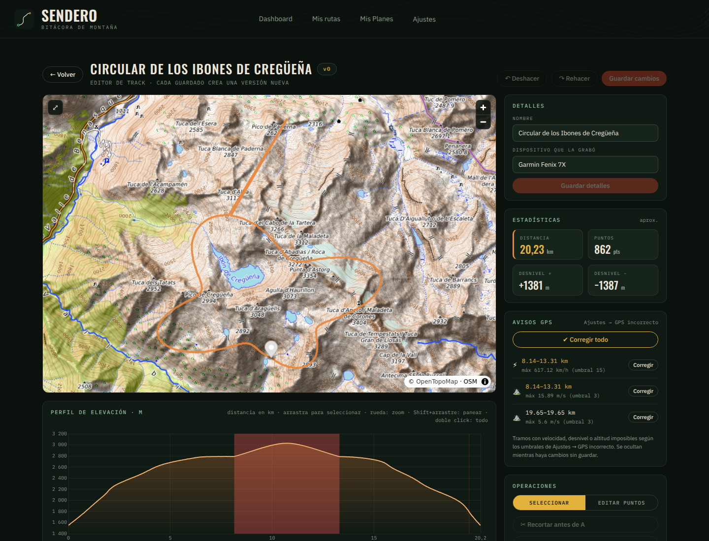
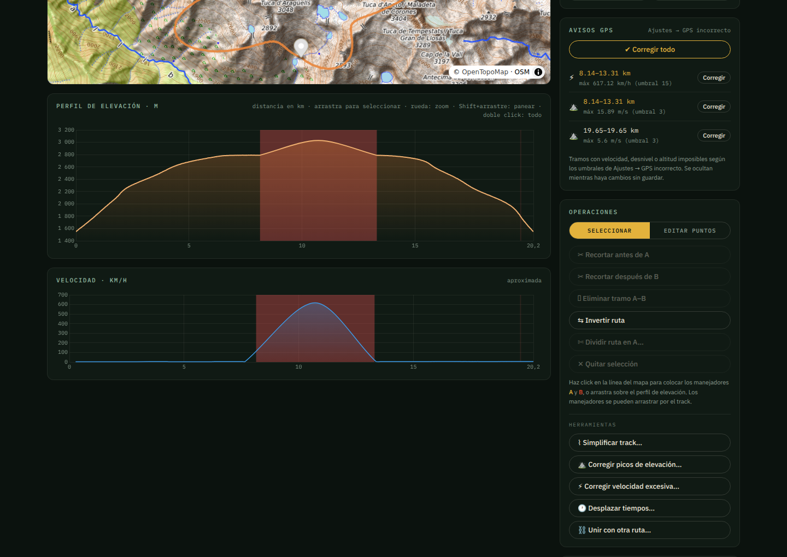

<p align="center">
  
</p>

<p align="center">
  <strong>Registra, visualiza y edita tus rutas GPX y FIT.</strong><br>
  <em>Autoalojado, sin nube y sin cuentas de terceros — tus datos se quedan en tu equipo.</em>
</p>

<p align="center">
  
  
  
  
</p>

---

**Sendero** es una bitácora autoalojada de rutas de montaña: una sola aplicación (Flask + SQLite, en un contenedor Docker) donde subes tus tracks **GPX** y **FIT** y los conviertes en un registro visual y navegable de tus salidas. Cada ruta se dibuja sobre mapas topográficos y de satélite con su perfil de elevación, velocidad y frecuencia cardíaca, calcula las estadísticas automáticamente y te deja asociar fotos —locales o de tu **Immich** por referencia—. Incluye un editor de tracks completo, detección de errores de GPS, analíticas globales y planificación de rutas futuras. Todo corre en un **único contenedor** en tu red local: sin servicios externos ni telemetría.

Es además una **aplicación instalable** (PWA) que **funciona sin conexión**: puedes llevarte el móvil al monte, con el servidor apagado en casa, y seguir consultando tus rutas y el mapa de la que vas a hacer.

---

## Funcionalidades principales

En resumen, Sendero te permite:

- 📊 **Dashboard con resumen global** — totales, mapa de todas tus rutas, desglose por actividad y por año, y récords personales.
- 🗺️ **Visualizar cada ruta** en mapa topográfico o satélite con perfil de elevación, velocidad y frecuencia cardíaca.
- 📈 **Estadísticas automáticas** — distancia, desnivel +/−, tiempo en movimiento, velocidad media, altitud máx/mín, FC media/máx.
- 📷 **Fotos por ruta** — locales o desde Immich; las que llevan GPS en el EXIF se sitúan solas sobre el mapa.
- ✏️ **Editor de tracks** — recortar, invertir, editar vértices, simplificar, corregir picos, dividir y unir rutas, con versionado.
- ⚠️ **Avisos de GPS** — detecta tramos con velocidad, desnivel o altitud imposibles y los corrige.
- 🎯 **Planificación** — sube los GPX de rutas que quieres hacer y tenlas en una lista aparte.
- 🔄 **Importación automática** — deja caer los GPX en una carpeta vigilada y aparecen solos.
- ⌚ **Sincronización con Mi Fit / Zepp** — baja los entrenamientos de tu reloj Amazfit/Zepp directamente de la cuenta Huami, sin exportar a mano.
- 🧹 **Sin rutas duplicadas** — detecta reimportaciones del mismo archivo o del mismo entrenamiento y evita repetirlas.
- 📴 **Uso sin conexión** — instálala como app y consulta tus rutas (mapa incluido) sin red y con el servidor apagado.

---

## Dashboard

> ℹ️ Las capturas de esta sección y de las dos siguientes son de una versión anterior a
> la 0.9.0, que rediseñó el dashboard, Mis Rutas y el detalle de ruta. Lo que describe cada
> lista debajo sí corresponde a la versión actual.

La portada de Sendero: un resumen de todo lo que has recorrido, con las cifras globales, el mapa de todas tus rutas y tus mejores marcas de un vistazo.



> **Lo que encuentras aquí:**
> - **Selector de año** y cinco cifras de cabecera: salidas, distancia, desnivel +, horas y zonas, cada una con su contexto (variación respecto al año anterior, media por salida, «N × Everest»…).
> - **Desnivel acumulado por mes**: doce barras que enseñan de un vistazo tu estacionalidad.
> - **Zonas más visitadas** y **almacenamiento** (cuánto ocupan la base, los tracks, las fotos, las miniaturas y los mapas descargados).
> - **Mapa** de todas las rutas con agrupación por zonas (*clustering*).
> - **Por actividad**: kilómetros y número de rutas de cada tipo (senderismo, bicicleta, caminata, correr, esquí, otros).
> - **Rutas por año** y **récords personales** —ruta más larga, mayor desnivel y velocidad media más alta—, cada uno enlazado a su ruta.
>
> Todo lo anterior, salvo los récords, se calcula **en tu propio dispositivo** con la lista que ya tiene guardada, así que el dashboard también funciona sin conexión y cambiar de año no gasta ni una petición.

---

## Mis Rutas

Todas tus salidas en un listado y un mapa navegable, con filtros y búsqueda.



> **Lo que encuentras aquí:**
> - **Filtros** por actividad (una píldora del color de cada una), por rango de fechas y **buscador** por nombre o zona.
> - **Mapa** con selector de capa base (aquí *Satélite*) y agrupación por zonas.
> - **Orden** por fecha (más reciente / más antiguo) y **modo edición** para selección múltiple.
> - **Filtro «⚠ Duplicadas»**, que solo aparece si la importación automática marcó alguna ruta como posible repetida.
> - **Tarjetas agrupadas por mes**, cada una con el color de su actividad, la **miniatura del track** de fondo, la distancia y la localidad.
> - Tres vistas — **Cuadrícula**, **Tabla** (densa, para repasar muchas salidas de un tirón) y **Panel** (lista estrecha con el mapa grande) — y botón **«+ Añadir ruta»**, que también acepta arrastrar y soltar.

---

## Detalle de ruta

Cada ruta abre una ficha completa con mapa, estadísticas, perfiles y fotos.



> **Lo que encuentras aquí:**
> - **El mapa es la cabecera**: el track sobre topográfico o satélite, y encima el tipo de actividad, la zona, el nombre y la línea de fecha · hora | archivo | dispositivo. Con **«Vista 3D»** y los marcadores de las fotos que llevan GPS.
> - **Banda de métricas**: distancia (destacada), desnivel +/−, altitud máxima, tiempo en movimiento, velocidad media y frecuencia cardíaca media y máxima.
> - **Perfil de elevación**, **velocidad** y **frecuencia cardíaca**, sincronizados entre sí y con el mapa al pasar el ratón.
> - **Datos técnicos** (tiempo total, pausas, ritmo medio, velocidad máxima, altitud mínima, puntos GPS, formato, versión) y **Calidad del track**, con los avisos de GPS de esa ruta y un enlace para corregirlos en el editor.
> - **Fotos** y **Resumen** editable.
> - Acciones: **Editar track** y **Exportar GPX** sobre el mapa; reescanear, guardar el mapa sin conexión, renombrar y eliminar tras el botón **⋯**.
>
> En el móvil el mapa ocupa el ancho completo y el resto se reparte en cuatro pestañas: Perfil, Fotos, Datos y Notas.

---

## Editor de rutas

Un editor de tracks completo con versionado *append-only*: cada guardado crea una versión nueva y puedes volver atrás cuando quieras.



> **En esta captura se ve:**
> - Panel **«Detalles»**: renombrar la ruta y cambiar el dispositivo sin salir del editor.
> - **Estadísticas aproximadas** (distancia, número de puntos, desnivel) recalculadas en vivo.
> - Panel **«Avisos GPS»** con la lista de tramos de velocidad/altitud imposibles y los botones **«Corregir»** y **«Corregir todo»**.
> - **Perfil de elevación** con bandas rojas marcando los tramos problemáticos.
> - **Deshacer / Rehacer**, versión actual (`v0`) y **«Guardar cambios»**.



> **En esta captura se ve:**
> - **Perfiles de elevación y velocidad** con las bandas de los avisos GPS.
> - Panel **«Operaciones»**: modos *Seleccionar* / *Editar puntos*, recortar inicio/fin, eliminar tramo, invertir y dividir la ruta.
> - Herramientas: **simplificar track** (Douglas-Peucker), **corregir picos de elevación**, **corregir velocidad excesiva**, **desplazar tiempos** y **unir con otra ruta**.
> - **Historial de versiones** restaurable.

---

## Planificación (Mis Planes)

¿Una ruta que quieres hacer? Sube su GPX a **Mis Planes** y quedará en una lista separada de tus salidas ya realizadas, con su mapa, estadísticas, notas y descarga del GPX. Desde ahí también puedes **dibujar una ruta nueva** en un planificador externo configurable (por defecto [brouter-web](https://brouter.de/brouter-web)).

## Sin conexión (y como app instalable)

Sendero es una **PWA**: desde el navegador puedes instalarla en el móvil o el escritorio y queda con su icono, sin barra de direcciones. Y guarda en el dispositivo la lista de rutas y planes y el detalle de las que abres, de modo que **sigue funcionando sin red y con el servidor apagado**.

Sin conexión puedes:

- Abrir la app en **cualquier pantalla** — dashboard, Mis Rutas, Mis Planes y las fichas.
- Consultar el **detalle** de las rutas y planes que ya se hayan sincronizado, con sus perfiles y sus fotos.
- **Editar** nombre, notas y tipo de actividad: los cambios se guardan y se envían solos al recuperar la red (la cabecera muestra cuántos quedan sin enviar).
- Ver el **mapa**, si antes has pulsado **«⬇ Mapa sin conexión»** en la ficha de esa ruta o plan. Ese botón guarda solo la franja de teselas por la que pasa el track —entre 250 y 380 para 40 km, unos 6-9 MB según lo recta que vaya la ruta—, no una región entera. Es lo que hace que el mapa se vea en el monte.

Sí necesitan conexión, y avisan en vez de fallar en silencio: subir rutas o fotos, el editor, Immich, reescanear y borrar.

En **Ajustes → Sin conexión** tienes el panel de control: estado de la copia local, **↓ Descargar todas las rutas** (para llevártelas al monte sin haberlas abierto una a una), cuánto ocupan los mapas descargados con su botón de borrar, y la cola de cambios pendientes de enviar.

> **Nota sobre el mapa base.** Las cuatro capas del selector (Topográfico, Callejero, Satélite, Oscuro) son de terceros y necesitan internet. Si quieres una quinta capa propia que funcione siempre, coloca un archivo **PMTiles** en `data/tiles/` y selecciónalo en **Ajustes → Mapas**; esa la sirve Sendero, así que funciona sin internet pero **con el servidor encendido**. Para el monte con el servidor apagado, lo que vale es el «⬇ Mapa sin conexión» de cada ruta.

## Si algo va raro después de actualizar

El precio de que la app funcione sin conexión es que el navegador guarda su código. Al publicar una versión nueva puede quedarse con parte del anterior, y entonces se ve **la app a medias**: botones que no responden, opciones que no cargan, pantallas incompletas… sin ningún error en el servidor.

La forma rápida de saber si es eso: **abre la misma dirección en una ventana de incógnito**. Si ahí funciona bien, no es la app ni el servidor — es lo que tu navegador tenía guardado.

Para arreglarlo, abre **`/actualizar`** (por ejemplo `https://tu-sendero/actualizar`, también en **Ajustes → Mantenimiento → «Actualizar la app en este dispositivo»**). Esa página borra el código guardado, sus cachés y la copia local de rutas y planes, y te deja volver a la app, que se descarga de cero y se sincroniza otra vez. En **Ajustes → Mantenimiento** tienes además el estado de este navegador: qué versión sirve el servidor y cuál tiene guardada tu dispositivo, que es lo que delata el problema. **No toca nada del servidor**: tus rutas, fotos y ajustes siguen intactos.

Si tienes Sendero **instalada como app**, cerrar la ventana no basta: usa `/actualizar` desde dentro de la app o desinstálala y vuelve a instalarla.

> **Detrás de un proxy con autenticación** (Pangolin, Authelia, oauth2-proxy…) puede aparecer en la consola `Access to manifest … blocked by CORS policy`. Es el manifiesto de la PWA, el único archivo que el navegador pide sin tu sesión; el aviso es inofensivo (solo afecta a instalar la app). Si te molesta, comprueba que tu sesión del SSO no ha caducado o excluye `/manifest.webmanifest` de la autenticación en el proxy.

## Immich (opcional)

Si tienes [Immich](https://immich.app), al abrir una ruta aparece el botón **⛰ Buscar en Immich**: Sendero toma la hora de inicio y fin del track, pregunta a Immich qué fotos se hicieron en esa ventana y te las muestra para elegir cuáles asociar. **No se copian: se enlazan por referencia**, así que Immich sigue siendo tu fototeca. Las que llevan GPS se marcan solas si están cerca del track; las demás se muestran igualmente (muchas fotos de montaña no llevan coordenadas). Ver la configuración más abajo.

---

## Arrancar

```bash
docker compose up -d --build
# abre http://localhost:8090   (el puerto host está en docker-compose.yml)
```

Los datos (GPX, fotos y base de datos) se guardan en `./data`, montado como volumen. Para mover la instalación a otro equipo, copia esa carpeta.

Sin Docker:

```bash
pip install -r requirements.txt
python app.py          # http://localhost:8080
```

## Conectar con Immich (opcional)

1. En Immich: **Cuenta → Configuración de la cuenta → Claves de API** → crea una clave.
   Dale al menos los permisos **`asset.read`** (buscar fotos) y **`asset.view`**
   (ver/descargar las miniaturas), o simplemente marca *todos los permisos*. Sin
   `asset.view` la búsqueda funciona y aparece el grid, pero **las miniaturas no
   cargan** (Immich responde con error de permisos y Sendero lo muestra como
   `502`); ver *Problemas frecuentes* más abajo.
2. En Sendero: botón **Ajustes** (cabecera) → sección Immich → pega la URL y la API key → Guardar.

Los ajustes se guardan en la base de datos y persisten entre reinicios. Si prefieres configurarlos como variables de entorno (útil para despliegues automatizados), puedes usar `IMMICH_URL`, `IMMICH_API_KEY`, `IMMICH_MARGIN_MIN` e `IMMICH_DIST_M`; la BD tiene prioridad si el valor también está guardado ahí.

> Cómo funciona el cruce: por **tiempo**, usando las marcas del track y el EXIF de las fotos en Immich. Por eso es importante que el reloj y el teléfono/cámara tengan la hora bien sincronizada.

### Problemas frecuentes con Immich

- **La búsqueda encuentra fotos y sale el grid, pero las miniaturas dan `502`
  (y no cargan).** La API key no tiene el permiso **`asset.view`**. Búsqueda y
  miniaturas usan permisos distintos: buscar solo necesita `asset.read`, pero
  servir cada imagen exige `asset.view`. Edita la clave en Immich (o crea una
  nueva) añadiendo `asset.view` — o marca todos los permisos — y vuelve a
  guardarla en Ajustes. No tiene que ver con exponer Sendero a internet ni con el
  reverse proxy: las miniaturas siempre las sirve el backend de Sendero por proxy,
  el navegador nunca habla con Immich.

## Cómo encaja con tu Amazfit T-Rex 3 Pro

1. En la app Zepp: abre el entrenamiento → menú `···` → **Exportar a GPX**.
2. El GPX queda en el teléfono. Con **Syncthing** sincronizas esa carpeta con el equipo donde corre Sendero (privado, sin nube).
3. En Sendero pulsas **+ Añadir ruta**, eliges el GPX y listo. O lo haces automático (abajo).

> El paso 1 sigue usando la app Zepp porque Gadgetbridge aún no extrae de forma fiable el track del T-Rex 3. Pero los archivos no salen de tu infraestructura.
>
> **Atajo sin exportar a mano:** si usas reloj Amazfit/Zepp/Mi Fit, la [auto-importación desde Mi Fit / Zepp](#importación-automática-desde-mi-fit--zepp) baja los entrenamientos directamente de la cuenta Huami, sin el paso de exportar GPX uno a uno.

## Importación automática (carpeta vigilada)

El servicio `watcher` del `docker-compose.yml` vigila la carpeta `./watch`. Apunta ahí tu carpeta sincronizada con Syncthing: cada GPX nuevo se sube solo a Sendero y se mueve a `./watch/imported/` (o a `./watch/failed/` si algo falla). Así, exportas en el reloj y la ruta aparece sola, sin tocar nada.

Variables (en el `docker-compose.yml`): `SENDERO_POLL` es cada cuántos segundos mira la carpeta (30 por defecto). El watcher espera a que el archivo deje de crecer antes de importarlo, para no pillar una copia de Syncthing a medias. Si no quieres importación automática, borra el servicio `watcher` del compose.

## Importación automática desde Mi Fit / Zepp

Si tienes un reloj **Amazfit / Zepp / Mi Fit**, Sendero puede bajar tus entrenamientos directamente de la cuenta **Huami** y crearlos como rutas, sin exportar GPX a mano. Lo hace el servicio `mifit-sync` del `docker-compose.yml` (proceso aparte, opcional: bórralo si no lo usas).

Configuración en **Ajustes → Mi Fit / Zepp**:

1. **apptoken de Huami**: pégalo (lo sacas de la [página GDPR de Huami](https://user.huami.com/privacy2/index.html?loginPlatform=web&platform_app=com.xiaomi.hm.health) → «Export data» → inicia sesión → F12 → pestaña Network → cabecera/cookie `apptoken`).
2. **Región**: Global / Europa / EE. UU. / China (las cuentas europeas suelen ser Europa).
3. **Importar desde** (opcional): fecha a partir de la cual importar. Vacío = todo el historial en la primera sincronización.
4. **Intervalo**: Manual, o cada 1 / 6 / 12 / 24 h con el interruptor de auto-sync.

Luego **↻ Sincronizar ahora** (trae lo nuevo desde la última vez) o **⟳ Reimportar desde la fecha** (vuelve a revisar el historial desde la fecha elegida). El panel muestra el estado y la **fecha y hora de la última sincronización**. Los entrenamientos indoor sin GPS se ignoran.

> **Nota:** el token de Huami caduca cada cierto tiempo; cuando pase, el panel avisa y basta con pegar uno nuevo. La captura del token con un clic (navegador integrado) está planificada, aún no disponible.

### Deduplicación (no se repiten rutas)

Al importar (a mano, por carpeta o desde Mi Fit) Sendero evita duplicados en dos niveles: el **mismo archivo** (idéntico byte a byte, aunque cambie el nombre) se rechaza siempre; y el **mismo entrenamiento reexportado** en otro formato se detecta por una huella (fecha + distancia + recorrido). En la web te pregunta antes de crear el duplicado; en la importación automática lo crea igual pero lo marca con **«⚠ posible duplicada»** (badge en la tarjeta y aviso en el detalle con «Descartar aviso») para que lo revises tú — nunca borra nada solo.

## Estructura

```
sendero/
├── app.py              # entrada Flask: registra blueprints, init_db() y refresh_config()
├── watch.py            # importador automático de carpeta (servicio aparte, no parte del server)
├── mifit_sync.py       # sincronizador Mi Fit/Zepp (servicio aparte, opcional)
├── core/               # lógica: config, BD, parseo GPX/FIT, thumbnails, edición, EXIF,
│                       #   Immich, análisis GPS, dedup, geocoding, cliente Mi Fit (core/mifit/)
├── api/                # blueprints REST: rutas, editor, fotos, planificación, Immich,
│                       #   ajustes, Mi Fit, sincronización, mapas y PWA
├── templates/
│   ├── base.html           # cabecera, modal de Ajustes y CSS global
│   ├── shell.html          # el documento único de la SPA
│   └── sec/                # las 6 vistas: dashboard, rutas, planes, detalle, plan, editor
├── static/
│   ├── js/core/            # router, almacén local + sincronización, cargador, mapas offline
│   ├── js/sec/             # un módulo por vista (mismo nombre que su plantilla)
│   ├── css/                # un archivo por vista
│   ├── vendor/             # MapLibre, Chart.js y pmtiles.js servidos en local (sin CDN)
│   ├── fonts/ · icons/     # tipografías e iconos de la PWA
│   └── sw.js               # Service Worker
├── tests/              # pytest (lógica pura) + pruebas de humo en Node y e2e con Playwright
├── requirements.txt
├── Dockerfile
├── docker-compose.yml
└── data/               # volumen: sendero.db, gpx/, photos/, thumbs/, tiles/
```

No hay paso de compilación: el frontend son `<script>` clásicos, sin npm ni bundler.

## API (por si quieres automatizar)

En las URLs, `{id}` es el **identificador público** de la ruta o el plan (una cadena corta y opaca, tipo `k3Qv9wTaZ1c`), no un número correlativo. Lo devuelve el listado en el campo `public_id` y es lo que aparece en la barra de direcciones.

| Método | Ruta | Acción |
|--------|------|--------|
| `GET`  | `/api/routes` | lista de rutas |
| `POST` | `/api/routes` | sube un GPX o FIT (campo `gpx`). Rechaza duplicados (`?force=1` fuerza; `?auto=1` importa marcando posibles duplicadas) |
| `GET`  | `/api/routes/{id}` | detalle: stats, track, perfil, fotos. `?lite=1` devuelve una versión aligerada (~20 KB en vez de ~350 KB) |
| `PATCH`| `/api/routes/{id}` | renombrar / guardar notas / actividad |
| `DELETE`| `/api/routes/{id}` | borrar ruta |
| `GET`  | `/api/routes/{id}/gpx` | descargar el archivo original |
| `POST` | `/api/routes/{id}/rescan` | volver a leer el archivo y recalcular todo |
| `POST` | `/api/routes/{id}/photos` | subir fotos locales (campo `photos`) |
| `GET`  | `/api/stats` | estadísticas globales (récords incluidos) |
| `GET`  | `/api/storage` | espacio en disco por carpeta: base, tracks, fotos, miniaturas y mapas |
| `GET`  | `/api/config` | indica si Immich está activo, la distancia de autoselección y la versión |
| `GET`  | `/api/settings` | leer ajustes actuales |
| `POST` | `/api/settings` | guardar ajustes (misma función que el modal Ajustes) |
| `GET`  | `/api/routes/{id}/immich/candidates` | fotos de Immich en la ventana del track |
| `POST` | `/api/routes/{id}/immich/select` | asocia los assets de Immich elegidos |
| `GET`  | `/api/planned` | lista de rutas planificadas |
| `POST` | `/api/planned` | añade una ruta planificada (campo `gpx`) |
| `GET`/`POST` | `/api/mifit/settings` | ajustes de Mi Fit/Zepp (token, región, intervalo, fecha) |
| `POST` | `/api/mifit/sync` | lanza una sincronización con Mi Fit (`{reset:true}` para reimportar) |
| `GET`  | `/api/mifit/status` | estado y fecha de la última sincronización |
| `GET`  | `/api/sync/state` | ¿ha cambiado algo? Con `If-None-Match` responde `304` sin cuerpo |
| `GET`  | `/api/sync/changes` | lo que ha cambiado desde `?since=<cursor>` (altas, cambios y bajas) |
| `GET`  | `/api/maps` | estado de los mapas base offline disponibles |

El editor tiene sus propios endpoints (`/points`, `/edit`, `/split`, `/merge`, `/versions/…`); están documentados en `CLAUDE.md`.

El endpoint `POST /api/routes` permite automatizar la importación: un script que vigile la carpeta de Syncthing puede hacer `curl -F "gpx=@ruta.gpx"` por cada archivo nuevo.

## Limitaciones honestas (lo que NO es)

- **No es un gestor de fotos.** No hace miniaturas optimizadas, ni álbumes, ni reconocimiento, ni subida automática desde el carrete. Si quieres eso, usa Immich y conserva Sendero solo para las rutas.
- **Sin usuarios ni login.** Pensado para uso personal en tu red. No lo expongas a internet sin poner delante un proxy con autenticación (p. ej. Authelia / Caddy con basic-auth).
- **La correlación de fotos** usa el GPS del EXIF. Si tus fotos no llevan coordenadas, se muestran en la galería pero no en el mapa.

---

<p align="center">
  <sub>Novedades de cada versión en el <a href="CHANGELOG.md">CHANGELOG</a>.</sub>
</p>
